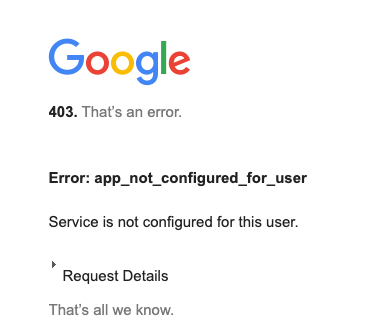
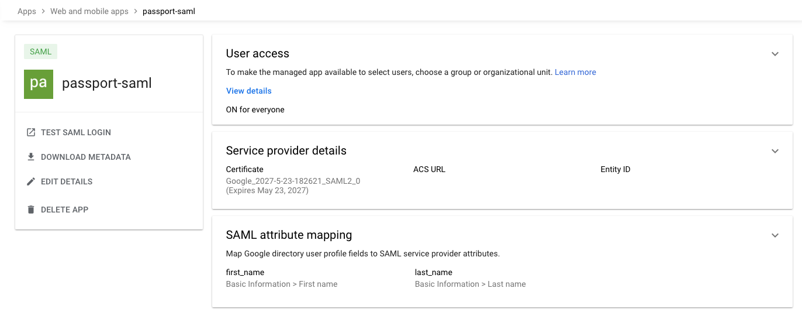

# Using Google as the IDP for a Custom SAML Application

This example will be a Passport NodeJS application that uses Google's Cloud Identity SAML provider for Single Sign On (SSO). This code works against the following Google Cloud [directions.](https://support.google.com/a/answer/6087519?hl=en&fl=1)

## Google Disclaimer
This is not an officially supported Google product

## Configure SAML on Google Cloud
1. Log in to your Google Administrator Console (admin.google.com)
1. Go to "Apps" -> "Web and mobile apps"
1. Select "Add app" and choose "Add custom SAML app"
1. Enter an application name and click "Continue"
1. Save the SSO URL and Certificate shown on the next page and click "Continue"
    * Store the certificate as idp_cert.pem in your "certs" deployment folder
    * Use the SSO URL as environment variable "SAML_ENTRY_POINT" during deployment below
1. Change the "Name ID format" to Email on the next page and click "Continue"
1. Use the following for the ACS URL [CloudRunURL]/login/callback and EntityID [CloudRunURL]
    * It will look something like this: </br>
        https://xxxxxxxxxxxxx.a.run.app/login/callback
1. Add any attribute mappings that you require (for this example I included the first name and last name attributes)
1. Enable the application for everyone, certain Organization Units, or Groups according to this documentation. Please review "Turn on your SAML app" in this [document.](https://support.google.com/a/answer/6087519?hl=en&fl=1)
    * If the application is not enabled for a user, they will experience an "app_not_configured_for_user" error such as this.



When you're complete, you'll have a properly configured custom SAML application


## Address Any Environment Restrictions (Optional)
```
cat > allowedPolicyMemberDomains.yaml << ENDOFFILE
name: projects/$PROJECT_NUMBER/policies/iam.allowedPolicyMemberDomains
spec:
  rules:
  - allowAll: true
ENDOFFILE
gcloud org-policies set-policy allowedPolicyMemberDomains.yaml
```

## Deploy Passport NodeJS Application to Cloud Run
```
#Setup Environment variables
export ORGANIZATION_ID=[GoogleOrgID]]
export PROJECT_NAME=saml-auth-example
export REGION=us-central1
export BILLING_ACCOUNT=[GoogleBillingID]
export SESSION_SECRET=[Choose a Session Secret]
export SAML_ENTRY_POINT=[SSO URL from Google IDP]

printf 'Y' | gcloud projects create --name=$PROJECT_NAME --organization=$ORGANIZATION_ID
export PROJECT_ID=$(gcloud projects list --filter=name:$PROJECT_NAME --format 'value(PROJECT_ID)')
export PROJECT_NUMBER=$(gcloud projects list --filter=name:$PROJECT_NAME --format 'value(PROJECT_NUMBER)')
gcloud beta billing projects link $PROJECT_ID --billing-account=$BILLING_ACCOUNT

printf 'y' |  gcloud services enable orgpolicy.googleapis.com
printf 'y' |  gcloud services enable compute.googleapis.com 
printf 'y' |  gcloud services enable artifactregistry.googleapis.com
printf 'y' |  gcloud services enable cloudbuild.googleapis.com

gcloud config set compute/region $REGION
gcloud config set project $PROJECT_ID

openssl req -x509 -sha256 -nodes -days 365 -newkey rsa:2048 -keyout cert/privateKey.key -out cert/certificate.crt

export SERVICE_NAME=saml-passport-example

gcloud iam service-accounts add-iam-policy-binding \
  $PROJECT_NUMBER-compute@developer.gserviceaccount.com \
  --member="serviceAccount:$PROJECT_NUMBER@cloudbuild.gserviceaccount.com" \
  --role="roles/iam.serviceAccountUser"

gcloud run deploy $SERVICE_NAME \
   --source . \
   --region $REGION \
   --allow-unauthenticated \
   --set-env-vars "SESSION_SECRET=$SESSION_SECRET" \
   --set-env-vars "SAML_ENTRY_POINT=$SAML_ENTRY_POINT"

DEPLOYMENT_URL=$(gcloud run services describe $SERVICE_NAME --region $REGION --format 'value(status.url)')
#NOTE: Update the ACS_URL and EntityID to the appropriate Cloud Run values in you're not using DNS Entries

gcloud run services update $SERVICE_NAME \
   --region $REGION \
   --update-env-vars "SAML_CALLBACK_URL=$DEPLOYMENT_URL/login/callback" \
   --update-env-vars "SAML_ISSUER=$DEPLOYMENT_URL"
```

## Google SAML IDP and Custom SP
* IDP Initiated: https://accounts.google.com/o/saml2/initsso?idpid=xxxxxxxx&spid=xxxxxxxx
* SP Initiated: See [DEPLOYMENT_URL] above

## Additional Information
* https://github.com/node-saml/passport-saml/discussions/671
* https://github.com/apache/cloudstack/issues/6427
* https://github.com/node-saml/passport-saml/commit/0155da466cfae968483d0467dc9093fa253bc8bf